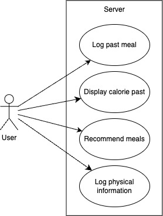

# Project Requirements
Group 05 - “Balanced”

Date: September 29, 2024

Group Members: Alonso Garcia, Kristopher Thomas, Robert McClung, Carlos Martinez

## 1. Positioning

| 1.1                    | Problem Statement  |
| ---------------------- | - |
| The problem of         | maintaining healthy dietary habits |
| affects                | young adults, including college students and gym goers |
| the impact of which is | negative effects on physical and mental health |

| 1.2         | Product Position Statement |
| ----------- | - |
| For         | young adults, including college students and gym goers |
| Who         | struggle to maintain healthy dietary habits |
| The         | Balanced app is a website |
| That        | tracks a users previous meals to recommend and provide the most optimal meal to maintain a balanced diet |
| Unlike      | EatWell101 and MyFitnessPal |
| Our product | goes beyond meal planning by tracking previous meals and offering personalized healthy suggestions for your next meal |

### 1.3 Value Proposition and Customer Segment

**Value Proposition**: Balanced is a free meal pplanning website that helps young adults maintain healthy dietary habits by tracking the nutritional value of their previous meals and offering personalized recommednations to meet their nutritional needs for their next meal.

**Customer Segment**: Young adults who want to maintain healthy dietary habits.

## 2. Stakeholders

- Users (Young Adults)

The users, mostly young adults, including college students and gym goers, will use the app to provide information to help maintain healthy dietary habits.

- Competitors (EatWell101 and MyFitnessPal)

Competitors relating to Balanced will be compared to see improvements or downgrades for the Balanced app.

- Developers

Developers will provide key features, debugging, testing, and applying user feedback to the Balanced app.

- Nutritionists

Nutritionists can provide input to the website, like meal recipes or plans, or recommend the Balanced app to potential users.

## 3. Functional Requirements (Features)

1. Meal logging
2. Body data tracking (weight, height)
3. Basal Metabolic Rate (BMR) Calculator
4. Food nutrition database
5. Add/customize meals
6. Meal recommendations
7. User feedback/support
8. Progress checker
9. Meal ratings
10. Community forums

## 4. Non-Functional Requirements

1. Usability - Functional requirements can be navigated to and are functioning as intended.
2. Security - User accounts and server database is secure.
3. Operability - The layout of the website is intuitive and can easily be navigated.
4. Compatibility - Website appears correctly on all devices, no buttons are cut-off.
5. Performance - Loading times are short and quickly responds to user input

## 5. Minimum Value Proposition (MVP)

Developing the minimum viable product would require 3 key processes. Firstly, the website should be developed. This would require a local-sided set-up for development and testing, and later a fully established server should be prepared. Secondly, the product would need the functional requirements implemented. The most important of these would be the meal logging and recommendation system. These should be developed first, as they work together and separate our product from the competition. Last is the testing and validation phase. Once the main set of features are prototyped, they should be validated through a series of tests. Testers should connect to the official server, rather than running the program locally, and these testers should be people we know who can give us feedback and opinions; so we can further improve the product.

## 6. Use Cases

### 6.1 Diagram

### 6.2 Descriptions And Interface Sketch

**Use Case 1: Log past meal**

Actor: Website User

Trigger: User ate a meal and wants to log it

Pre-conditions: User is logged in

Post-condition: Meal is logged to the user’s database

Success Scenario:
1. User initiates request
2. System requests date of meal
3. User inputs the date of the meal
4. System requests the rest of the meal data
5. User inputs the rest of the meal data
6. System adds the data in the user data under the given date
7. System confirms the data was logged
Alternate Scenarios:
6a. Logged meal data exceeds the storage limit
1. Remove oldest logged meal

**Use Case 2: Display Calorie Past**

Actor: Website User

Pre-conditions: User is logged in and has placed meals in before

Post-condition: Calorie past is displayed

Success scenario:
1. User initiates request
2. User selects time-frame
3. System pulls the amount of calories from the specified time-frame
4. System displays the calories
   
Alternate Scenarios:

3a. System doesn’t find previous meal
1. Server displays that no meals were found

**Use Case 3: Recommend Meals**

Actor: Website User

Trigger: User wants to plan a future meal

Pre-conditions: User is logged in

Post-condition: Meal recommendations are displayed to the user

Success Scenario:
1. User initiates request
2. User selects time-frame for recommendations
3. Server calculates balance of user’s meals from the time-frame
4. Server displays recommendations

Alternate Scenarios:

3a. User has a small amount of meals logged within the time-frame
1. Server notifies user about lack of data

3b. User has NO meals logged within the time-frame
1. Server notifies user about MISSING DATA
2. Server cancels the recommendation

**Use Case 4: Log Physical Information**

Actor: Website User

Trigger: User wants to update or add new data

Pre-conditions: User is logged in

Post-condition: Physical data is logged to the user’s database

Success Scenario:
1. User initiates request.
2. User inputs their physical data.
3. System logs the physical data into the user’s database.
4. System displays success to the user.

Alternate Scenarios:

3a. User’s physical data storage is at the limit.
1. System will remove a piece of data that is not the oldest one.
   
3b. System timed out.
1. Display error to the user.
2. Cancel the action.

## 7. User Stories

- As a weight watcher, I want a database that can give food suggestions, so that I can choose foods that will help me maintain my weight

- As an athlete, I want a meal plan that helps me determine my calories for the day, so I can plan my meals accordingly without staying hungry.

- As someone new to meal planning, I want a tool that helps make grocery shopping easier, so I can make shopping less of a hassle.

- As someone concerned about my health, I want to track my calories, so I can lose unwanted weight.

- As a father, I want to see the kind of nutrients each meal has, so that I know which food to feed to my kids.

- As a nutritionist, I want to add my meal recipes, so that I can help my clients learn how to maintain healthy habits with their diet.

- As a gym goer, I want to track my body progression, so I can see if I gained muscle.

- As a college student, I want to have pre-planned meals for the week, so I can save time on choosing what to eat.

## 8. Issue Tracker
