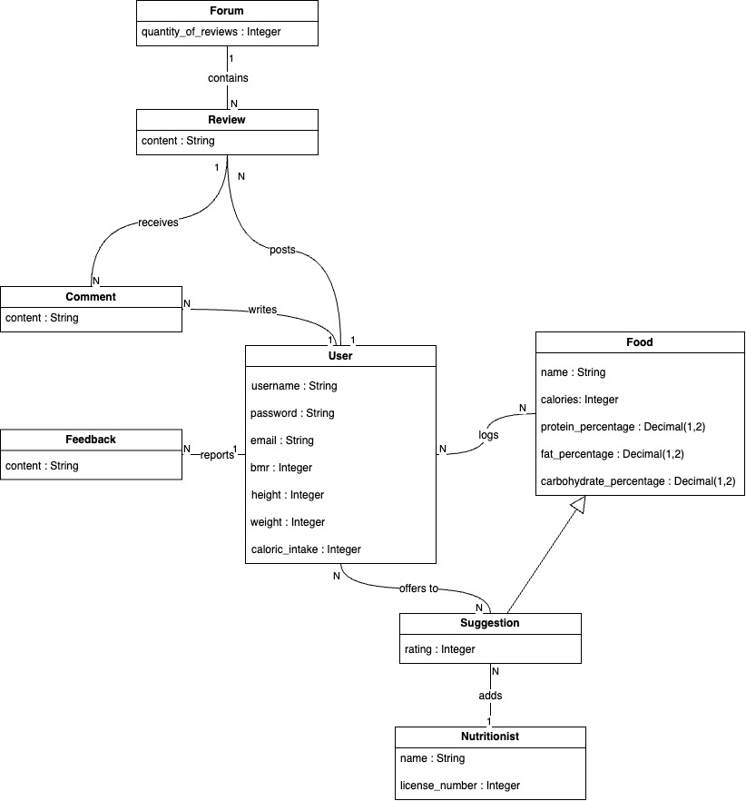

# 1. System Description

The problem of struggling to maintain healthy dietary habits affects young adults, including college students and gym goers. The impact of which has negative effects on physical and mental health. For young adults, including college students and gym goers, who struggle to maintain healthy dietary habits. The Balanced app is a website that tracks a **user's** previous eating habits to recommend and provide the most optimal **meal** to maintain a balanced diet. Unlike EatWell101 and MyFitnessPal, our product goes beyond meal planning by **_tracking_** previous **meals** and **_offering_** personalized healthy **suggestions** for the next one. Balanced is a free meal planning website that helps young adults in college, and gym goers, maintain healthy dietary habits by **_tracking_** the nutritional value of their previous **meals** and **_offering_** personalized **recommendations** to meet their nutritional needs for their next **meal**.

The key requirements for the Balanced includes Python for backend logic, MongoDb for managing **meal** and **user** data, and a stable internet connection to ensure seamless access to the website. Plus, the website provides core functionality such as the _Basal Metabolic Rate (MBR)_ calculator, nutritional data access, **user** progress tracking, and performance are vital non-functional requirements to ensure that **user** data is secure, the interface is easy to use, and the website performs correctly across different devices. 

The system provides a personalized experience allowing the **user** to create their profile, which includes _username_, _password_, _email_, _BMR_, and _caloric intake_. The **user** can **_log_** their past **meals**, which include a _name_, _calories_, and percentages of _proteins_, _fats_, and _carbohydrates_, to track progress. **Users** can **_input_** data like their _height_ and _weight_, use a calculator to assess their _BMR_, and receive targeted **meal** **recommendations**. A **nutritionist** facilitates input from experts by **_adding_** **meal** **recipes** to the database. These meals provided by a **nutritionist** will be **suggestions** add a _rating_ of the meal from the **nutritionist**. Additionally, a **nutritionist** needs to provide their _name_ and _license number_ to show their reliability. Community interaction is fostered through a **forum**, which contains the _number_ of **reviews**, where **users** can post **meal** **reviews** _content_ and **_write_**, or **_receive_**, **comments** with other **user's** _content_ for feedback. To maintain progress, the system includes features for tracking _calories_ over time, offering insights for the **user** through personalized statistics; such as their change in _height_, _weight_, and a history of their calorie intake. The website also supports **Feedback** submission, where users can **_report_** issues or suggestions, in the form of **comments**.

# 2. Model

