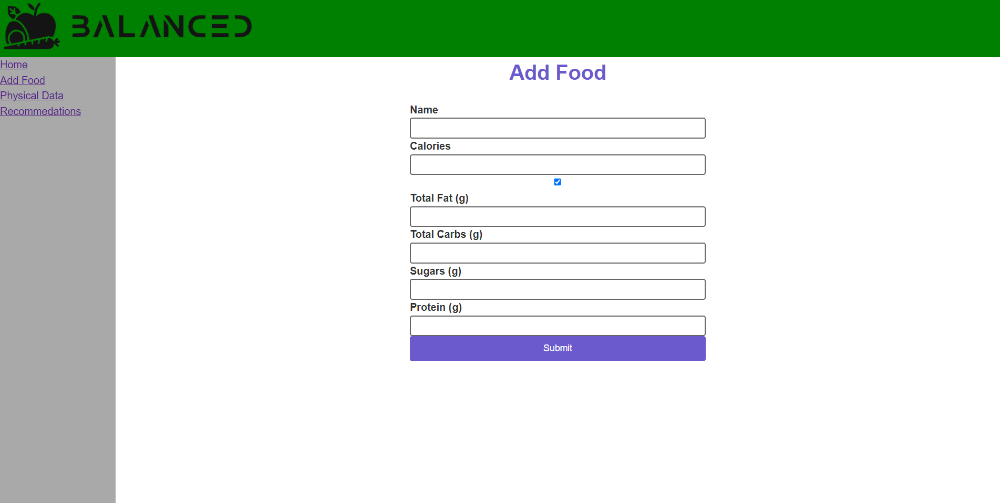

# 1. Introduction

Balanced is a free meal planning website that helps young adults in college, and gym goers, maintain healthy dietary habits by tracking the nutritional value of their previous meals and offering personalized recommendations to meet their nutritional needs for their next meal.

Balanced is still in the works of getting all it’s features finalized, but it currently includes its main features of a simple interface, logging meals, tracking physical data, like weight and height, a database that stores food for users to see what they’ve eaten, and adding meals to the database. Future plans include profile creation, food recommendations, bmr calculator, progress tracking, and feedback submission.

[Github Repo](https://github.com/abg287/Balanced)

# 2. Implemented requirements

## 2.1

**Requirement: As a nutritionist, I want to add my meal recipes, so that I can help my clients learn how to maintain healthy habits with their diet.**

**Issue: https://github.com/abg287/Balanced/issues/9**

**Pull request: https://github.com/abg287/Balanced/pull/24**

**Implemented by: Alonso Garcia**

**Approved by: Robert McClung**

**Print screen:** 

## 2.2

**Requirement: As a father, I want to see the kind of nutrients each meal has, so that I know which food to feed to my kids.**

**Issue: https://github.com/abg287/Balanced/issues/4**

**Pull request: https://github.com/abg287/Balanced/pull/41**

**Implemented by: Robert McClung**

**Approved by: Alonso Garcia**

**Print screen:** 

## 2.3

**Requirement: As someone concerned about my health, I want to track my calories, so I can lose unwanted weight.**

**Issue: https://github.com/abg287/Balanced/issues/5**

**Pull request:**

**Implemented by: Kristopher Thomas**

**Approved by: Alonso Garcia**

**Print screen:** 

## 2.4

**Requirement: As a gym goer, I want to track my body progression, so I can see if I gained muscle.**

**Issue: https://github.com/abg287/Balanced/issues/10**

**Pull request:**

**Implemented by: Carlos Martinez**

**Approved by: Alonso Garcia**

**Print screen:** 

# 3. Tests

You should implement automated tests that aim to verify the correct behavior of your code. Provide the following information:

Test framework you used to develop your tests (e.g., JUnit, unittest, pytest, etc.)
Link to your GitHub folder where your automated unit tests are located
An example of a test case. Include in your answer a GitHub link to the class being tested and to the test
A print screen showing the result of the execution of the automated tests
Grading criteria (4 points): You should have an adequate number of automated tests. They should be well-written to exercise the main components of your system, covering the relevant inputs.

# 4. Adopted technologies

List the adopted technologies with a brief description and justification for choosing them.

Grading criteria (1 point): This section will be evaluated in terms of correctness, completeness, thoroughness, consistency, coherence, and adequate use of language.

# 5. Learning/training

Describe the strategies employed by the team to learn the adopted technologies. 

Grading criteria (1 point): This section will be evaluated in terms of correctness, completeness, thoroughness, consistency, coherence, and adequate use of language.

# 6. Deployment

Provide a link for the system in production and describe how you are deploying your system. 

Some alternatives for deploying your system in the cloud: 

AWS. AWS Educate offers free credits for students. See the tutorial at https://docker-curriculum.com/Links to an external site. on how to create a container and deploy it on AWS. 
Digital Ocean or Azure. As part of the GitHub Education benefits, as a student, you can get $100 at Digital Ocean and $100 at Microsoft Azure cloud computing platforms (see more details at https://education.github.com/studentsLinks to an external site.).
Oracle Cloud. Oracle offers a free tier in its cloud environment that should be more than enough for your needs.
Firebase. Firebase can be a good choice if you are building a mobile phone app. 
 Grading criteria (3 points): This section will be graded based on the adequate use of the technology and its adequate description. 

# 7. Licensing

Inform the license you adopted for your source code (remember to configure GitHub accordingly). Explain why you adopted this license. For more information, check https://choosealicense.com/Links to an external site..

Grading criteria (1 point): This section will be evaluated in terms of correctness, completeness, thoroughness, consistency, coherence, and adequate use of language.

# 8. README File

You should also prepare your repository to receive new developers. You should prepare a README.md file. See an example at https://gist.github.com/PurpleBooth/109311bb0361f32d87a2Links to an external site.. In the README file, the current version of the software should be stated. You should follow the Semantic VersioningLinks to an external site. schema. Tag the GitHub repository accordingly (see Git Basics TaggingLinks to an external site.). 

Your repository should contain a CONTRIBUTING.md file, a LICENSE file, and a CODE_OF_CONDUCT.md file. Search online for some examples of these files. In this section of the deliverable, put links to these files on GitHub.

Grading criteria (3 points): This section will be based on the presence and quality of the information presented in the files.

# 9. Look & feel

Describe the approach you adopted to design your user interface. Include some screenshots.

Grading criteria (3 points): This section will be graded based on the appearance (aesthetics) and usability (ease of use) of the system.

# 10. Lessons learned

In retrospective, describe what your team learned during this first release and what you are planning to change for the second release. 

Grading criteria (2 points): Adequate reflection about problems and solutions, clear description with adequate use of language. 

# 11. Demo

Include a link to a video showing the system working.

Grading criteria (6 points): This section will be graded based on the quality of the video and on the evidence that the features are running as expected. Additional criteria are the relevance of the demonstrated functionalities, the correctness of the functionalities, and the quality of the developed system from the external point of view (user interface).

