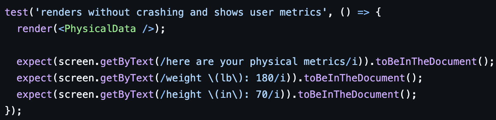

# 1. Introduction

Balanced is a free meal planning website that helps young adults in college, and gym goers, maintain healthy dietary habits by tracking the nutritional value of their previous meals and offering personalized recommendations to meet their nutritional needs for their next meal.

Balanced is still in the works of getting all it’s features finalized, but it currently includes its main features of a simple interface, logging meals, tracking physical data, like weight and height, a database that stores food for users to see what they’ve eaten, and adding meals to the database. Future plans include profile creation, food recommendations, bmr calculator, progress tracking, and feedback submission.

https://github.com/abg287/Balanced

# 2. Implemented requirements

### 2.1

**Requirement: As a nutritionist, I want to add my meal recipes, so that I can help my clients learn how to maintain healthy habits with their diet.**

**Issue: https://github.com/abg287/Balanced/issues/9**

**Pull request: https://github.com/abg287/Balanced/pull/24**

**Implemented by: Alonso Garcia**

**Approved by: Robert McClung**

**Print screen:** 

### 2.2

**Requirement: As a father, I want to see the kind of nutrients each meal has, so that I know which food to feed to my kids.**

**Issue: https://github.com/abg287/Balanced/issues/4**

**Pull request: https://github.com/abg287/Balanced/pull/41**

**Implemented by: Robert McClung**

**Approved by: Alonso Garcia**

**Print screen:** 

### 2.3
**Requirement: As a gym goer, I want to track my body progression, so I can see if I gained muscle.**

**Issue: https://github.com/abg287/Balanced/issues/10**

**Pull request: https://github.com/abg287/Balanced/pull/45**

**Implemented by: Kristopher Thomas**

**Approved by: Alonso Garcia**

**Print screen:** 

### 2.4

**Requirement: As someone concerned about my health, I want to track my calories, so I can lose unwanted weight.**

**Issue: https://github.com/abg287/Balanced/issues/5**

**Pull request:**

**Implemented by: Carlos Martinez**

**Approved by: Alonso Garcia**

**Print screen:**

# 3. Tests

You should implement automated tests that aim to verify the correct behavior of your code. Provide the following information:

Test framework you used to develop your tests (e.g., JUnit, unittest, pytest, etc.)
Link to your GitHub folder where your automated unit tests are located
An example of a test case. Include in your answer a GitHub link to the class being tested and to the test
A print screen showing the result of the execution of the automated tests
Grading criteria (4 points): You should have an adequate number of automated tests. They should be well-written to exercise the main components of your system, covering the relevant inputs.

# 4. Adopted technologies

1. Visual Studio Code; source code editor developed by Microsoft - Used to write the Javascript, HTML, and CSS, also has good compatibility with Git for version control.
2. Javascript; universally used programming language for websites - Used to write the code for the website
3. Node.js; open-source JavaScript runtime environment - Used to run the website
4. MongoDB; document-oriented database program - Used for data base storage and API to access it.
5. React; open-source front-end JavaScript library for building user interfaces based on components by Facebook Inc - Used for client server communication for the website, and for modularization of the HTML/CSS

# 5. Learning/training

1. Through normal and online clasees with NAU, everyone learned VS Code and Javascript.
2. Learned how to use MongoDB in CS312. Taught the other team members how to use it.
3. Learned how to use React in CS312. Other team members were taught and learned through studying the other's code.
4. Everyone learned how to use Node.js in CS212. 

# 6. Deployment

Provide a link for the system in production and describe how you are deploying your system. 

Some alternatives for deploying your system in the cloud: 

AWS. AWS Educate offers free credits for students. See the tutorial at https://docker-curriculum.com/Links to an external site. on how to create a container and deploy it on AWS. 
Digital Ocean or Azure. As part of the GitHub Education benefits, as a student, you can get $100 at Digital Ocean and $100 at Microsoft Azure cloud computing platforms (see more details at https://education.github.com/studentsLinks to an external site.).
Oracle Cloud. Oracle offers a free tier in its cloud environment that should be more than enough for your needs.
Firebase. Firebase can be a good choice if you are building a mobile phone app. 
 Grading criteria (3 points): This section will be graded based on the adequate use of the technology and its adequate description. 

# 7. Licensing

We adopted the MIT license. It is clear and straight forward for both developers and users; it allows for broad use and collaboration; gives credit to the original authors; and provides legal clarity to reduce potential disputes over usage rights.

# 8. README File

[README.md](https://github.com/abg287/Balanced/blob/deliverables/README.md)

[CONTRIBUTING.md](https://github.com/abg287/Balanced/blob/deliverables/CONTRIBUTING.md)

[LICENSE](https://github.com/abg287/Balanced/blob/deliverables/LICENSE)

[CODE_OF_CONDUCT.md](https://github.com/abg287/Balanced/blob/deliverables/CODE_OF_CONDUCT.md)

# 9. Look & feel

Clear header at the top of every web page that presents the brand logo and color theme. The navigation bar on the left side of the page should allow for easy navigation between pages; whether you want to see the meals displayed with their nutritional value, add a meal to the database, or track your physical data over time. This bar with the web page links should also remain on every page, so that users don't get trapped on one. The large white section of the page is where the main application/feature appears. This will accordingly be swapped out depending on the feature. 

# 10. Lessons learned

The user cases we had were not quite clear for the features we want represented, so we had trouble linking them to the features when we added them. We should follow the user cases more clearly when implementing future versions.

The primary features we wanted were a much larger undertaking than we expected, and actually built off of the smaller features in the user stories. These are the meal recommendations and the user accounts. Now that the data base is prepared, and we can properly log meal data and physical data, these should be easily implemented for version 2.

# 11. Demo

https://youtu.be/9-O7QxV63Rc
