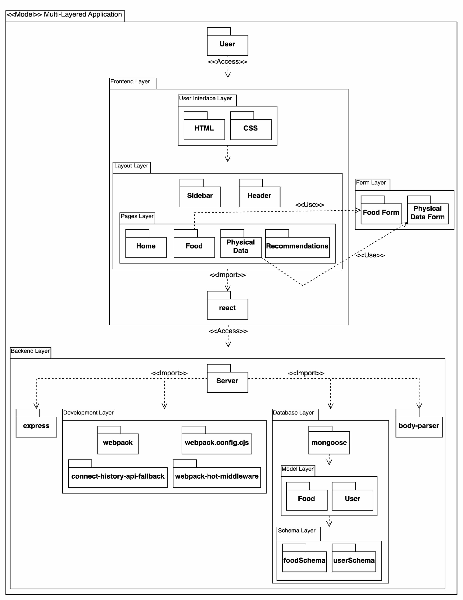
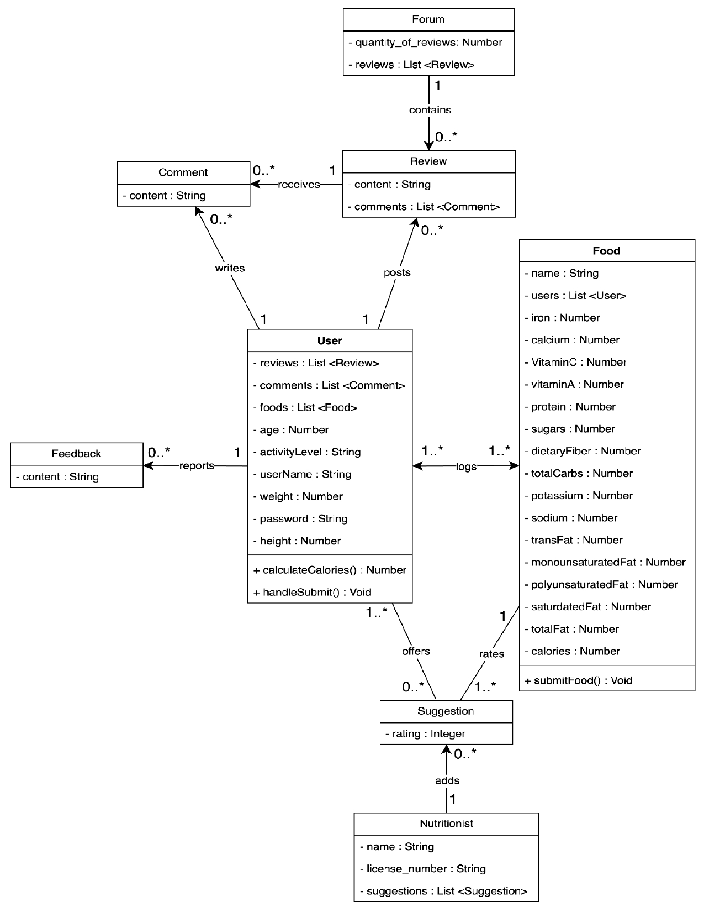
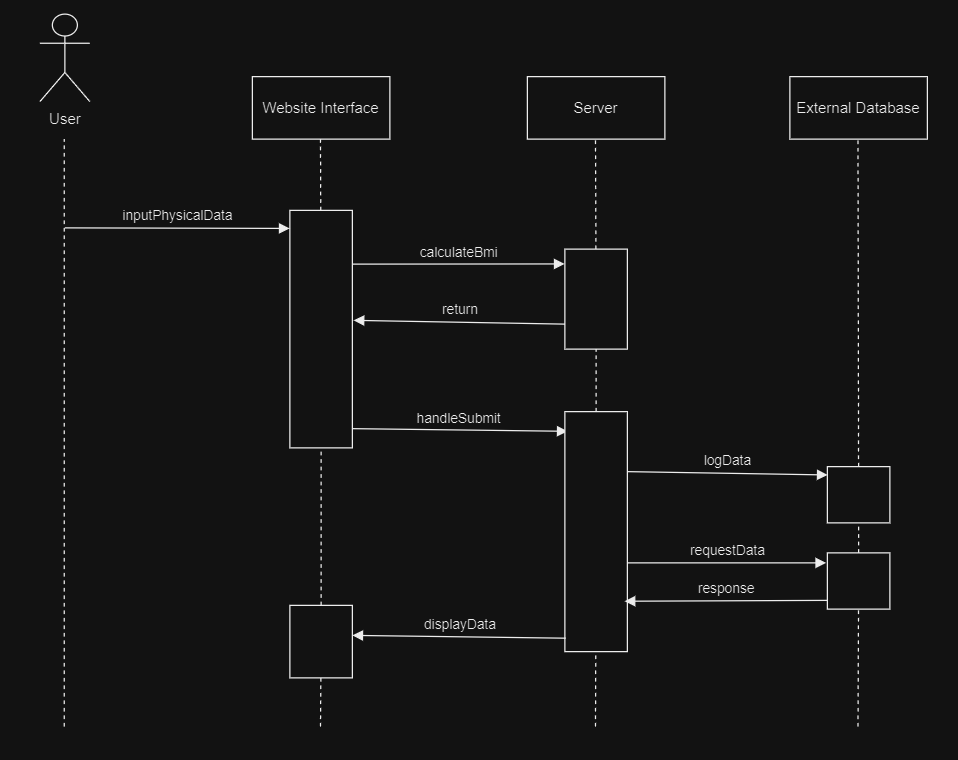
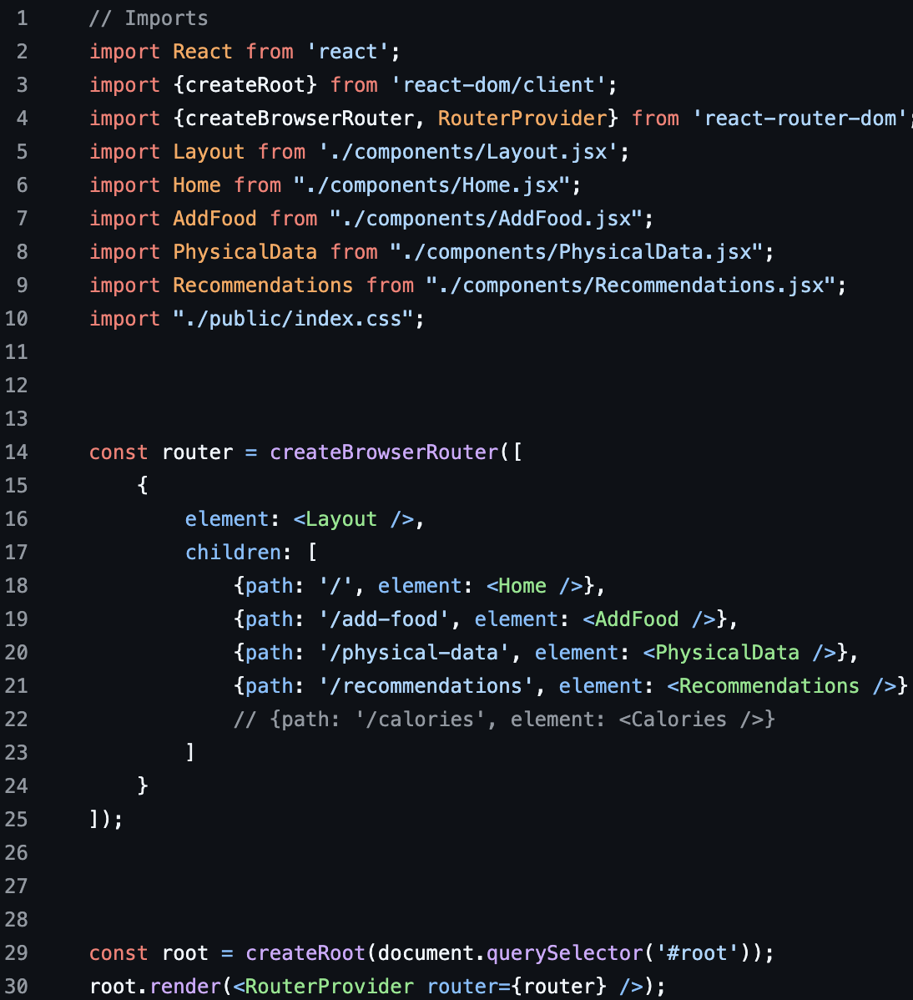
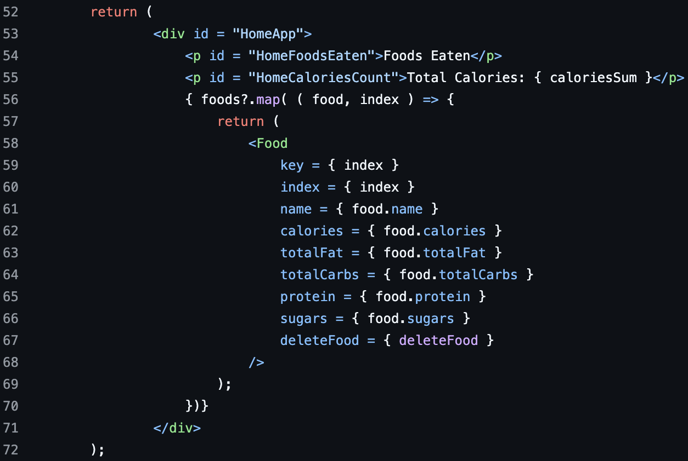

# 1. Description

The Balanced app is a website that tracks a user's previous eating habits to recommend and provide the most optimal meal to maintain a balanced diet. The user can log their past meals, which include a name, calories, and percentages of proteins, fats, and carbohydrates, to track progress. Users can input data like their height and weight, use a calculator to assess their BMR, and receive targeted meal recommendations. To maintain progress, the system includes features for tracking calories over time, offering insights for the user through personalized statistics; such as their change in height, weight, and a history of their calorie intake.
	As the website depends on a lot of personal data, using a 3rd party service to store data allows it to be more secure, stable, and available 24/7. So many of the systems we have in place are built around pulling data from and storing to this service, through use of their API. The food/meal data does not require as much security, but they are a key part of most features; so they need to be very stable. There are only a few operations run on the client side, such as the BMI calculator and total calorie count.

# 2. Architecture

The architecture is set up like this because this is how our file structure works in a nutshell. It helps define what packages depend on, use, or access to other packages. For example, the frontend needs access to the backend so the user can see what is stored on their profile. Other packages like Server use imports that help with development, data storage, and deployment.

# 3. Class Diagram

# 4. Sequence Diagram

Use Case: Update Physical Data
Actor: User
Trigger: Personal physique change
Pre-conditions: Logged in
Post-condition: Physical data is updated and new data is logged in the database

Success Scenario: 

1. User requests to update their physical data
2. Server prompts for physical data
3. User inputs the physical data
4. User confirms
5. User side calculates BMI
6. Server sends data to the external database
7. Server displays the newly logged data, from the database, to the user

Alternate Scenarios:

5a. Error logging to the database
1. Do not update the data

5b. Cannot connect to database / database down
1. Inform user that the data cannot be logged or displayed

# 5. Design Patterns

Split this section into two subsections. For each subsection, present a UML class diagram showing the application of a design pattern to your system (a different pattern for each section). Each class diagram should contain only the classes involved in the specific pattern (you don’t need to represent the whole system). You are not limited to design patterns studied in class. You can pick any pattern, including those outside the Gang of Four (GoF) patterns. You can see the list of GoF patterns here: [https://en.wikipedia.org/wiki/Design_Patterns](https://en.wikipedia.org/wiki/Design_Patterns)

Tip: Your system may not be appropriate for any design pattern. In this case, for didactic purposes, be creative and extend the scope of your system slightly to make the design patterns appropriate. 

Implement each design pattern in your system and provide GitHub links to the corresponding classes. For example (the links are illustrative, aka fake!):

Pattern name: Strategy

Car: [https://github.com/user/repo/blob/master/src/com/proj/main/Car.javaLinks](https://github.com/user/repo/blob/master/src/com/proj/main/Car.javaLinks)

IBreakBehavior: [https://github.com/user/repo/blob/master/src/com/proj/main/IBreakBehavior.java](https://github.com/user/repo/blob/master/src/com/proj/main/IBreakBehavior.java)

BrakeWithABS: [https://github.com/user/repo/blob/master/src/com/proj/main/BrakeWithABS.java](https://github.com/user/repo/blob/master/src/com/proj/main/BrakeWithABS.java)

Brake: [https://github.com/user/repo/blob/master/src/com/proj/main/Brake.java](https://github.com/user/repo/blob/master/src/com/proj/main/Brake.java) 

Grading criteria (6 points, 3 for each pattern): Correct use of the design pattern as described in the literature; adequate implementation of the design pattern.

# 6. Design Principles

Our design observes design principles by applying the following design principles, high cohesion and coupling.

Starting with high cohesion, we are applying a library that Java Script has access to, which is React. React helps create the user interface for web or app development by applying modularity. It does this by using a simple import at the top of a file. If you look below, you will see a picture of *index.jsx* that will show its use of high cohesion

As you can see, a lot of imports are used to get access to each component of the interface. After the first block, it applies a layout (*Layout.jsx*), which is just the header and sidebar to keep it as a template. After it applies the layout, the app can render different pages like the home page, food page, etc. Also, you'll see a comment that gets rid of the calories page. If we were to implement a calories page, we could simply create the file and then uncomment it to allow the page to be accessible. So, this makes adding pages easy and quick.

Moving on, coupling is applied by making the logic only inside the originating file itself. Some files do "rely" on other files to keep functionalities working. However, it will not cause a break cascade in the app since the parent component will be sending data to its child component. This means that if the child component is removed, the parent component will not be affected at all. If we take a look at the picture below, the home page uses the component *Food.jsx* which displays a food's nutritional facts.

So, if we were to remove the block that loops through all the foods, the resulting page would just display "Foods Eaten" and "Total Calories: ...". Now, it removes the user's capability to view their foods, but everything works just as fine if a child component was removed.

In sum, our design applies high cohesion to help with maintainability modularity, and coupling to keep everything in working condition if we were to remove any components from our website
