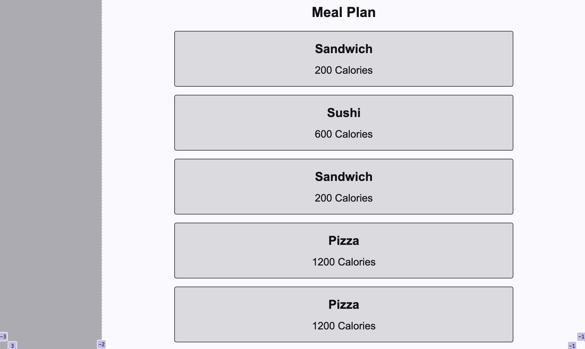

# 1. Introduction

Balanced is a free meal planning website that helps young adults in college, and gym goers, maintain healthy dietary habits by tracking the nutritional value of their previous meals and offering personalized recommendations to meet their nutritional needs for their next meal.

Balanced is still in the works of getting all it’s features finalized, but it currently includes its main features of a simple interface, logging meals, tracking physical data, like weight and height, a database that stores food for users to see what they’ve eaten, and adding meals to the database. Future plans include profile creation, food recommendations, bmr calculator, progress tracking, and feedback submission.

<https://github.com/abg287/Balanced>

# 2. Implemented Requirements

## 2.1

**Requirement**: As an athlete, I want a meal plan that helps me determine my calories for the day, so I can plan my meals accordingly without staying hungry.

**Issue**: [#7](https://github.com/abg287/Balanced/issues/7)

**Pull request**: [#53](https://github.com/abg287/Balanced/pull/53)

**Implemented by**: Alonso Garcia

**Approved by**: Robert McClung

**Print screen**: 

## 2.2

**Requirement**: As someone new to meal planning, I want to see reviews, so I know which meals are delicious.

**Issue**: [#6](https://github.com/abg287/Balanced/issues/6)

**Pull request**: TBA

**Implemented by**: Carlos Martinez

**Approved by**: TBA

**Print screen**: TBA

## 2.3

**Requirement**: As a college student, I want to have pre-planned meals for the week, so I can save time on choosing what to eat.

**Issue**: [#11](https://github.com/abg287/Balanced/issues/11)

**Pull request**: [#52](https://github.com/abg287/Balanced/pull/52)

**Implemented by**: Kristopher Thomas

**Approved by**: TBA

**Print screen**: TBA

## 2.4

**Requirement**: As a weight watcher, I want a database that can give food suggestions, so that I can choose foods that will help me maintain my weight

**Issue**: [#8](https://github.com/abg287/Balanced/issues/8)

**Pull request**: TBA

**Implemented by**: Robert McClung

**Approved by**: TBA

**Print screen**: TBA

# 3. Tests

## 3.1 Unit tests

A unit test is an automated test that aims to verify the behavior of a component isolated from the rest of the system. For this deliverable, show an example of a unit test that uses mock objects to isolate the class from the rest of the system. 

Test framework you used to develop your tests (e.g., JUnit, unittest, pytest, etc.)
Link to your GitHub folder where your automated unit tests are located
An example of a test case that makes use of mock objects. Include in your answer a GitHub link to the class being tested and to the test
A print screen showing the result of the unit test execution
Grading criteria (2 points): adequate choice of a test framework, coverage of the tests, quality of the tests, adequate use of Mock objects, and a print screen showing successful test execution.

## 3.2 Acceptance tests

An acceptance test is a test that verifies the correct implementation of a feature from the user interface perspective. An acceptance test is a black box test (the system is tested without knowledge about its internal implementation). Provide the following information:

Test framework you used to develop your tests (e.g., Selenium, Katalon Studio, Espresso2, Cucumber, etc.)
Link to your GitHub folder where your automated acceptance tests are located
An example of an acceptance test. Include a GitHub link to the test and an explanation about the tested feature in your answer.
A print screen/video showing the acceptance test execution
Grading criteria (2 points): adequate choice of a test framework, coverage of the tests, quality of the tests, adequate example of an acceptance test, print screen/video showing successful test execution.

# 4. Demo

Include a link to a video showing the system working.

Grading criteria (10 points): This section will be graded based on the quality of the video and on the evidence that the features are running as expected. Additional criteria are the relevance of the demonstrated functionalities, the correctness of the functionalities, and the quality of the developed system from the external point of view (user interface).

# 5. Code Quality

Describe how your team managed code quality. What were your policies, conventions, adopted best practices, etc., to foster high-quality code? 

Grading criteria (3 points): Adequate list of practices that were adopted to improve code quality and clear description with adequate use of language.

# 6. Lessons Learned

In retrospect, describe what your team learned during this second release and what you would change if you would continue developing the project. 

Grading criteria (2 points): Adequate reflection about problems and solutions, clear description with adequate use of language.
