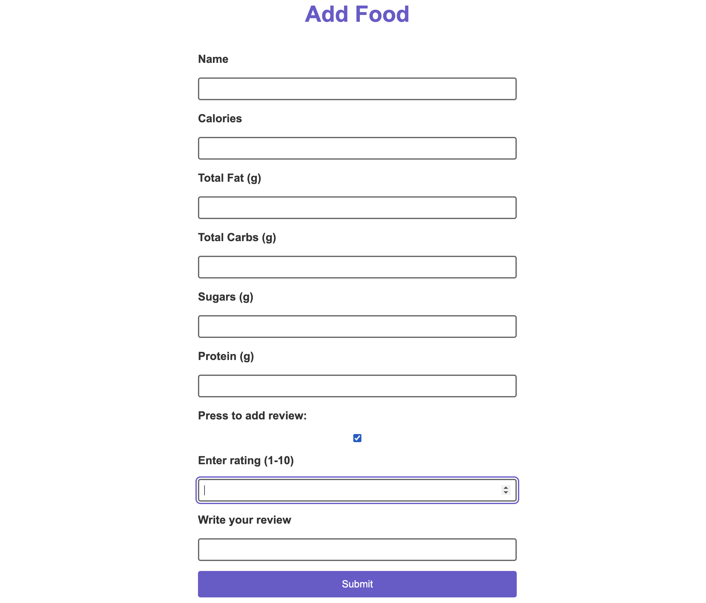
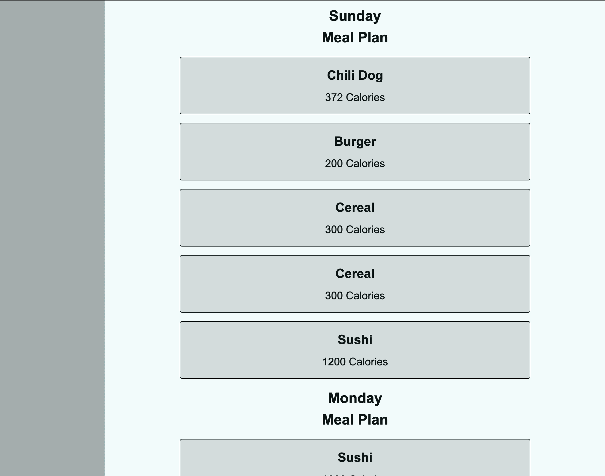
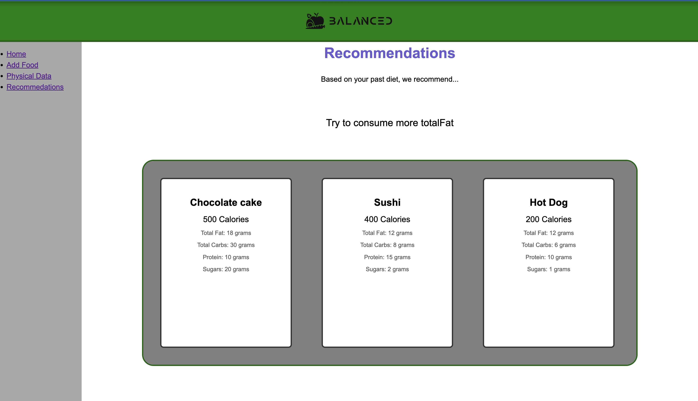
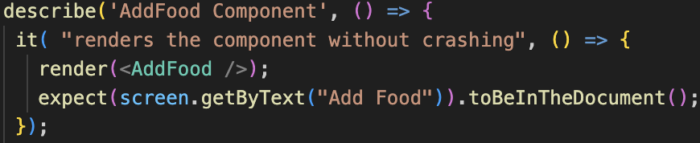
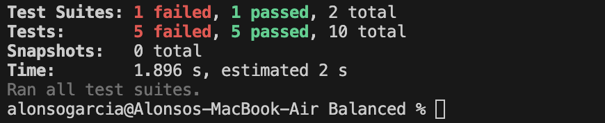
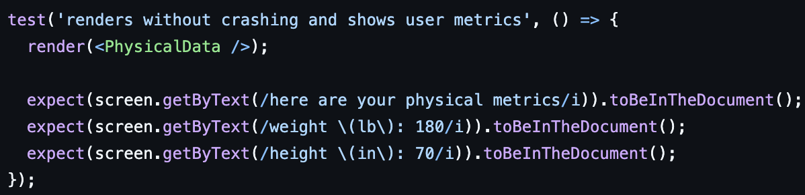

# 1. Introduction

Balanced is a free meal planning website that helps young adults in college, and gym goers, maintain healthy dietary habits by tracking the nutritional value of their previous meals and offering personalized recommendations to meet their nutritional needs for their next meal.

Balanced is still in the works of getting all it’s features finalized, but it currently includes its main features of a simple interface, logging meals, tracking physical data, like weight and height, a database that stores food for users to see what they’ve eaten, and adding meals to the database. Future plans include profile creation, food recommendations, bmr calculator, progress tracking, and feedback submission.

<https://github.com/abg287/Balanced>

# 2. Implemented Requirements

## 2.1

**Requirement**: As an athlete, I want a meal plan that helps me determine my calories for the day, so I can plan my meals accordingly without staying hungry.

**Issue**: [#7](https://github.com/abg287/Balanced/issues/7)

**Pull request**: [#53](https://github.com/abg287/Balanced/pull/53)

**Implemented by**: Alonso Garcia

**Approved by**: Kristopher Thomas

**Print screen**: 

## 2.2

**Requirement**: As someone new to meal planning, I want to see reviews, so I know which meals are delicious.

**Issue**: [#6](https://github.com/abg287/Balanced/issues/6)

**Pull request**: [#55](https://github.com/abg287/Balanced/pull/55)

**Implemented by**: Carlos Martinez

**Approved by**: Robert McClung

**Print screen**: 

## 2.3

**Requirement**: As a college student, I want to have pre-planned meals for the week, so I can save time on choosing what to eat.

**Issue**: [#11](https://github.com/abg287/Balanced/issues/11)

**Pull request**: [#52](https://github.com/abg287/Balanced/pull/52)

**Implemented by**: Kristopher Thomas

**Approved by**: Alonso Garcia

**Print screen**: 

## 2.4

**Requirement**: As a weight watcher, I want a database that can give food suggestions, so that I can choose foods that will help me maintain my weight

**Issue**: [#8](https://github.com/abg287/Balanced/issues/8)

**Pull request**: [#56](https://github.com/abg287/Balanced/pull/56)

**Implemented by**: Robert McClung

**Approved by**: Alonso Garcia

**Print screen**: 

# 3. Tests

## 3.1 Unit tests

Automated tests will be linked [here](https://github.com/abg287/Balanced/tree/main/src/tests). The test framework used was unittests. The package "jest" tests the website's forms for form validation or actions expected. Below is a snippet of code that tests [AddFood.jsx](https://github.com/abg287/Balanced/blob/main/src/client/components/AddFood.jsx) to see if the additional options button works (Press [here](https://github.com/abg287/Balanced/blob/main/src/tests/AddFood.test.jsx) to the link of AddFood.test.jsx):

The next picture is the report made after testing form components of our website:

## 3.2 Acceptance tests

The acceptance test will be linked [here](https://github.com/abg287/Balanced/tree/main/src/tests). The test framework used to develop our tests was Jest. Jest creates mock websites to input values inside forms for all of our components in the website. Below is a picture that tests one of our forms that input's the user's physical metrics. It tests it by inputting normal values and expecting it to accept the input and update it within the website. Test will be linked [here](https://github.com/abg287/Balanced/blob/main/src/tests/PhysicalData.test.jsx).

Below is the execution of the acceptance test and it'll show what was accepted or failed.

# 4. Demo

Demo link is [here](https://nau.zoom.us/rec/play/t8y1NSfPGN1kE7o1ftyvwCMoxM6AANBEQNZM8gcygYhftlGVGttPBs4_i0nUVzFkyyG72CiMBt5IxdE.tTR6xuB7xYXYtI1F?autoplay=true&startTime=1732477275000)

# 5. Code Quality

Our team managed code quality by applying JavaScript linters on our files to ensure our code follows JavaScript standards. This would then help us as a team to manage a clean and organized repository. The adopted best practice we did was initialize variables/functions at the start of a file or function so we know what each variable does. This helps organize the high-quality code. A convention in JavaScript is to set functions as constant variables, so React can have an easier time accessing it and better syntax looks, which leads to high-quality code. Lastly, the policies we applied to our project was to always explain code whether it was in comments, commit descriptions, or in real life. This helps us learn more about React as some teammates in Balanced are not well informed about React.

# 6. Lessons Learned

In retrospect, describe what your team learned during this second release and what you would change if you would continue developing the project. 

Grading criteria (2 points): Adequate reflection about problems and solutions, clear description with adequate use of language.

There are two prominent teachings that we discovered during our work on this second release. The first lesson was learned after our in-person development session. One weekend the team met up to tackle this deliverable, we did not do this for the previous release. It shocked us how much more effective we were as we developed in-person together. Previously we did our development individually, with long delays between answers in the chat room. This meet-up not only provided us with more active communication, but we could more easily bounce ideas off of eachother. Furthermore, it fostered a comfortable environment to work in. If this project were to continue, we would definitely host more of these meet-ups. The second lesson we learned shortly after the first release. Our development process for that one was quite confusing, we didn't precisely know who was implementing what. Shortly after it was graded, we learned that we each needed to create a solution for a user-story. As we followed this approach for the second release, it made the development process much more organized and clear.
